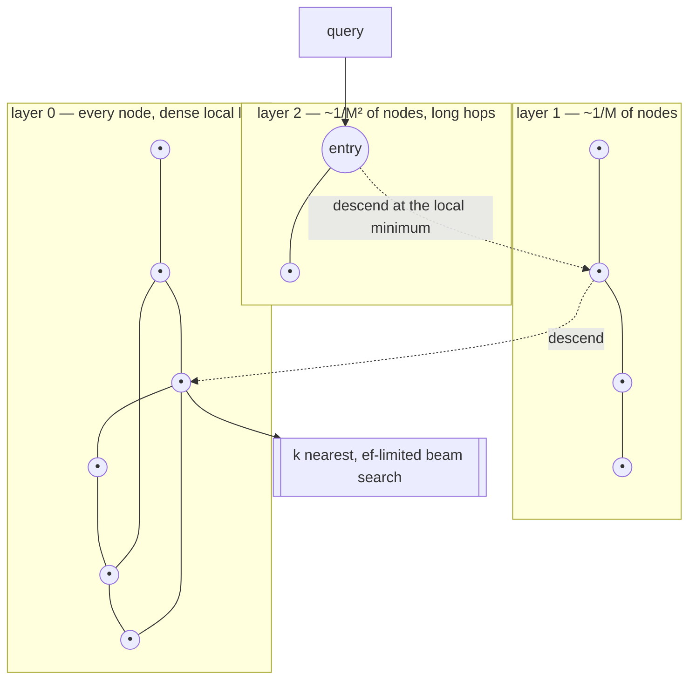

# lodestar

An **approximate nearest-neighbour index** for high-dimensional vectors: Hierarchical Navigable
Small World graphs, with product quantization for compression.

Written from scratch in Go with **zero external dependencies**, standard library only.


```
200,000 vectors × 128 dimensions, Apple M2

ef      recall@10   queries/s   vs brute force
10         0.9057       18,950           951x
80         0.9965        5,290           266x
160        1.0000        3,954           198x
```

---

## Why approximate

Exact nearest-neighbour search over high-dimensional vectors has no good answer, and that is a fact
about geometry rather than about implementations. Every space-partitioning structure that works in
two or three dimensions — kd-trees, ball trees, R-trees — degenerates to a full scan as the
dimension climbs, because in high dimensions almost every point is roughly equidistant from every
other and there is nothing left to prune. Ten thousand dimensions of embedding do not contain ten
thousand dimensions of structure, but they contain enough to defeat any method that tries to cut the
space into boxes.

So the goal changes. Find something that is *almost always* the exact answer, in logarithmic rather
than linear time, and make the trade explicit and tunable. On the data below, an index that returns
the exact top-10 answer 91% of the time runs **951× faster** than the scan it replaces, and one that
gets it exactly right every time still runs **198× faster** — the difference between them is a
single query-time parameter, with no rebuild in between.

HNSW gets there by giving up on partitioning space and navigating a graph instead. Each vector is a
node linked to its close neighbours, and a search walks greedily downhill toward the query. A single
flat graph gets stuck in local minima, so the graph is layered: sparse long-range links at the top
to cross the space in a few hops, dense short links at the bottom for precision. It is a skip list
where the ordering is distance rather than a key.



The descent is greedy and needs no backtracking; only the bottom layer runs a real beam search, and
the width of that beam — `ef` — is the single dial that trades recall for latency. Nothing else
needs retuning to move along the curve.

## Architecture

```
index.go             the public API, node storage, and the layer distribution
graph.go             insert, search, the neighbour-selection heuristic, deletion
heaps.go             the two priority queues a search runs on, open-coded
visited.go           generation-stamped visited set, O(1) to reset
quantize.go          compression as a post-build step, and asymmetric distances
persist.go           binary format with a CRC over the whole payload
internal/vecmath/    the distance kernels, unrolled eight wide
internal/pq/         product quantization: k-means++, codebooks, ADC tables
cmd/lodestar-bench/  the recall-versus-throughput harness
```

Three decisions are worth pulling out, because they are where the interesting engineering is.

### Searches take no locks

Adding a vector edits the neighbour lists of the nodes it links to, so a naive implementation
guards every list with a mutex and every search then contends with every insert. Instead a
neighbour list is **immutable once published**: a writer builds a new slice and swaps an
`atomic.Pointer` to it, so readers load the pointer and walk the slice with no lock at all. The
worst a concurrent insert can do to a running search is hide an edge that did not exist when the
search started.

The write lock is held only for the two operations that genuinely change the index's shape —
appending to the vector array and moving the entry point — and both are short. The expensive part of
an insert, which is thousands of distance computations, runs under a read lock alongside every
concurrent search. `TestConcurrentAddAndSearch` builds an index from four goroutines while four
others query it, and then asserts recall, because `-race` proves there is no data race while only
recall proves no edges were lost.

### Pruning uses the diversity heuristic, not the nearest neighbours

When a node's neighbour list overflows, the obvious repair is to drop the farthest link. Doing that
slowly strangles the graph: every node ends up connected only to its own cluster, the long-range
edges disappear, and searches get stuck exactly where the layered design was supposed to prevent it.

So the list is re-selected with the paper's heuristic instead. A candidate is accepted only if it is
closer to the node than to any already-accepted neighbour — a candidate sitting behind one already
chosen, same direction but farther, is rejected as redundant, and the budget goes to a direction not
yet covered. That is what manufactures the long links the upper layers need, and it is the
difference between a graph that navigates and one that merely stores.

### The visited set is stamped, not cleared

A search touches a few hundred nodes out of potentially millions, so clearing a bitset between
searches would cost more than the search. Each slot instead holds a generation number and a reset is
a single increment. The wraparound after four billion searches is handled rather than ignored,
which is the only O(n) reset the structure ever performs.

## Usage

```go
ix, err := lodestar.New(lodestar.Config{
    Dim:            128,
    Metric:         lodestar.Cosine,  // or L2, InnerProduct
    M:              16,               // graph degree: memory vs recall
    EfConstruction: 200,              // build quality, fixed at build time
})

for id, vec := range vectors {
    ix.Add(uint64(id), vec)
}

// ef is the recall dial and can change per query.
hits, err := ix.Search(query, 10, 64)
for _, h := range hits {
    fmt.Println(h.ID, h.Distance)
}

// Filtering happens during the walk, not after it, so a selective filter
// still returns k results instead of whatever survived.
hits, _ = ix.SearchFiltered(query, 10, 200, func(id uint64) bool {
    return tenant[id] == "acme"
})

ix.Delete(42)          // tombstoned: still a stepping stone, never a result

f, _ := os.Create("index.lodestar")
ix.Save(f)             // links included, so loading is a read, not a rebuild
```

## Benchmarks

Apple M2 (8 cores), Go 1.26. 200,000 vectors of 128 dimensions drawn from 200 gaussian clusters,
`M=16`, `efConstruction=200`. Recall is measured against exact brute-force answers for the same
queries. Reproduce with `make bench`.

| Stage | Time | Rate |
|---|---:|---:|
| Build (single goroutine) | 61.0 s | 3,280 vectors/s — 305 µs/vector, 5 layers |
| Brute-force scan (the baseline) | 50.2 s | 20 queries/s |

| ef | recall@10 | queries/s | vs brute force |
|---:|---:|---:|---:|
| 10 | 0.9057 | 18,950 | **951×** |
| 20 | 0.9451 | 11,982 | 601× |
| 40 | 0.9780 | 7,640 | 383× |
| 80 | 0.9965 | 5,290 | 266× |
| 160 | **1.0000** | 3,954 | **198×** |
| 320 | 1.0000 | 3,045 | 153× |

The shape is the point. Recall is bought back by raising one number, and even at perfect recall the
index is two orders of magnitude ahead of the scan — because a search at ef=160 touches a few
thousand of the 200,000 vectors rather than all of them.

### Concurrency

Searches take no locks, so they scale; inserts take a brief write lock, so they do not. Both are
measured (`go test -run xxx -bench 'Search|Add' .`), because a design claim without a number behind
it is just a comment:

| Goroutines | Searches/s | Inserts/s |
|---:|---:|---:|
| 1 | 15,037 | 3,642 |
| 2 | 28,352 | 3,514 |
| 4 | 43,439 | 3,411 |
| 8 | 57,462 | 3,471 |

Search throughput scales 3.8× across the M2's eight cores — close to the ceiling, given four of them
are efficiency cores. Insert throughput is flat, and the reason is specific: every insert needs the
write lock briefly to append to the shared arrays, and Go's `RWMutex` blocks new readers once a
writer is queued, so the short exclusive phase serializes the long shared one behind it. Fixing it
means removing the append from the critical path — chunked, preallocated storage with an atomic
slot counter — which is the next thing worth doing to this index.

## Product quantization, and the measurement that explains it

A 128-dimensional float32 vector costs 512 bytes, so ten million of them cost 5 GB and no longer fit
in memory — and an index that does not fit in memory reads from disk on every hop of every
traversal. Product quantization splits each vector into subvectors, runs k-means over each subspace,
and stores which centroid each landed on: with 256 centroids per subspace a code is one byte.

The distance computation never decompresses. Before the search, the query's distance to all 256
centroids of every subspace goes into a table; after that, the approximate distance to any stored
vector is a handful of table lookups. The query keeps its full precision — which is why it is called
*asymmetric* — and only the stored side is approximated.

The interesting result is what happens when you turn the search effort up:

| ef | codes only | codes + rerank |
|---:|---:|---:|
| 40 | 0.1357 recall @ 8,594 q/s | 0.2630 recall @ 8,828 q/s |
| 160 | 0.1511 recall @ 4,818 q/s | 0.5552 recall @ 4,552 q/s |
| 640 | 0.1547 recall @ 2,384 q/s | **0.9559** recall @ 1,724 q/s |

*200,000 vectors × 128 dimensions, 32 subspaces — 32 bytes per vector instead of 512, a 16× reduction.*

**Without reranking, recall does not respond to `ef` at all.** That is not a bug and it is worth
understanding: raising `ef` makes the walk visit more nodes, which can only help when the limit is
*which nodes were visited*. Here the limit is the codes. The ten smallest approximate distances have
already been found, and looking at ten times as many candidates does not change which ten they are.
The curve is flat because the error has nothing to do with the graph.

Keeping the raw vectors and rescoring the survivors exactly changes the question being asked, and
recall climbs back to the exact baseline. The two error sources — the graph's and the quantizer's —
are independent, and reranking removes one of them. That is the whole argument for `KeepVectors`,
stated as a measurement rather than an opinion, and it is asserted in
`TestQuantizationErrorIsIndependentOfEf`.

One honest note the numbers make obvious: at this scale **compression buys memory, not latency**.
Codes-only search is barely faster than exact search, because a 128-dimensional distance is already
only tens of nanoseconds. Quantization pays when the uncompressed index would not fit in RAM — which
is exactly when it is reached for, and never before.

## The distance kernels

A profile of a build attributes **34% of samples to `L2Squared` alone**, which is the correct shape
for an ANN index — everything else is bookkeeping around distance computations. So the kernel is
written for the compiler rather than for the reader, and the comparison is kept as a permanent
benchmark (`make kernels`):

| 128-dimensional squared distance | Time |
|---|---:|
| Naive loop | 97 ns |
| Unrolled 4 wide | 33 ns |
| **Unrolled 8 wide** | **29 ns** |

Two things do the work. Re-slicing to a fixed-width window lets the compiler prove the indexes are
in range and drop the bounds checks. Eight separate accumulators break the dependency chain — a
single running sum makes every addition wait for the previous one, and floating-point addition has
several cycles of latency, so the naive loop stalls on itself rather than on memory.

Go has no portable SIMD intrinsics, so this is as far as the standard library goes. A NEON assembly
kernel would go further, at the cost of one implementation per architecture, and that is the main
reason this is several times slower to build than hnswlib rather than a factor of algorithm.

## Testing

```bash
make race     # full suite under the race detector
make cover
```

**30 tests, 82% statement coverage**, all under `-race`.

The suite is built around a brute-force oracle: every recall assertion compares against exact
answers computed the slow way, never against another run of the index — an index that is
consistently wrong in the same way would sail through that. The thresholds are what make a
regression visible, since a damaged graph does not crash, it just answers slightly worse.

Worth naming:

- **`TestRecallImprovesWithEf`** — recall must rise with the search width and reach 0.98. A flat
  curve means `ef` is not wired through; a high value at one point proves nothing on its own.
- **`TestEveryVectorFindsItself`** — the cheapest possible connectivity check. A node no search can
  reach fails it however good the average recall looks.
- **`TestQuantizationErrorIsIndependentOfEf`** — the measurement described above, asserted in both
  directions: flat without reranking, rising with it.
- **`TestConcurrentAddAndSearch`** — four writers and four readers, then a recall assertion, because
  a lost copy-on-write update is invisible to the race detector.
- **`TestLoadRejectsCorruption`** — a single flipped bit must be caught. Without the checksum the
  failure is silent: a corrupted link array does not crash, it quietly makes every future search
  worse and nothing says so.
- **`TestBuildIsDeterministic`** — a fixed seed must give a fixed graph, or none of the numbers above
  would be reproducible and every regression would look like noise.
- **`TestEncodePicksTheNearestCentroid`** — checks the quantizer against exhaustive search over all
  256 centroids of every subspace, which is the entire contract of `Encode`.

## Design notes and limitations

Stated plainly, since they are the honest boundary of the project:

- **Builds are several times slower than hnswlib.** The algorithm is the same; the gap is SIMD.
  Distance computation is a third of the profile, and Go cannot express NEON or AVX portably.
- **Deletion is a tombstone.** The node stays in the graph as a stepping stone, because physically
  removing one can disconnect the region it bridged. Space is reclaimed by rebuilding, and an index
  with many deletions carries their cost in memory and in a little search work.
- **No incremental persistence.** `Save` writes the whole index; there is no journal, so a crash
  mid-build loses everything since the last save.
- **A very selective filter degrades toward a scan.** The filter is applied during the walk and the
  graph is still traversed through non-matching nodes, which keeps it connected but means the search
  does more work per result. Raising `ef` is the mitigation; a filter matching one row in ten
  thousand wants a different index entirely.
- **Quantization is post-build and all-or-nothing.** Vectors added after `Quantize` are not
  supported once the raw vectors are dropped, and there is no partial or per-segment compression.
- **Everything is in memory.** No mmap, no disk-resident graph, so the index must fit in RAM — which
  is the constraint product quantization exists to push back, not to remove.
- **Inserts do not scale across cores.** Measured above and diagnosed there: the brief write lock
  taken to append to the shared arrays serializes the long lock-free phase behind it. Searches are
  unaffected and scale nearly linearly.
- **One index, one process.** No sharding, no replication, no server. Pointing raftkv at this to
  replicate a sharded index is the obvious next project rather than a missing feature of this one.

## Related

- **[lsmdb](https://github.com/dhananjaypesu/lsmdb)** — LSM-tree storage engine: skip-list memtable,
  write-ahead log, bloom-filtered SSTables, leveled compaction.
- **[quarry](https://github.com/dhananjaypesu/quarry)** — a SQL database built on lsmdb: parser,
  binder, access-path selection, volcano executor.
- **[raftkv](https://github.com/dhananjaypesu/raftkv)** — Raft consensus: leader election, log
  replication, snapshotting, linearizable reads.

## References

- Malkov & Yashunin, [*Efficient and robust approximate nearest neighbor search using Hierarchical
  Navigable Small World graphs*](https://arxiv.org/abs/1603.09320) (2016)
- Jégou, Douze & Schmid, *Product Quantization for Nearest Neighbor Search* (2011)
- Arthur & Vassilvitskii, *k-means++: The Advantages of Careful Seeding* (2007)
- Malkov et al., *Approximate nearest neighbor algorithm based on navigable small world graphs*
  (2014)

## License

MIT
